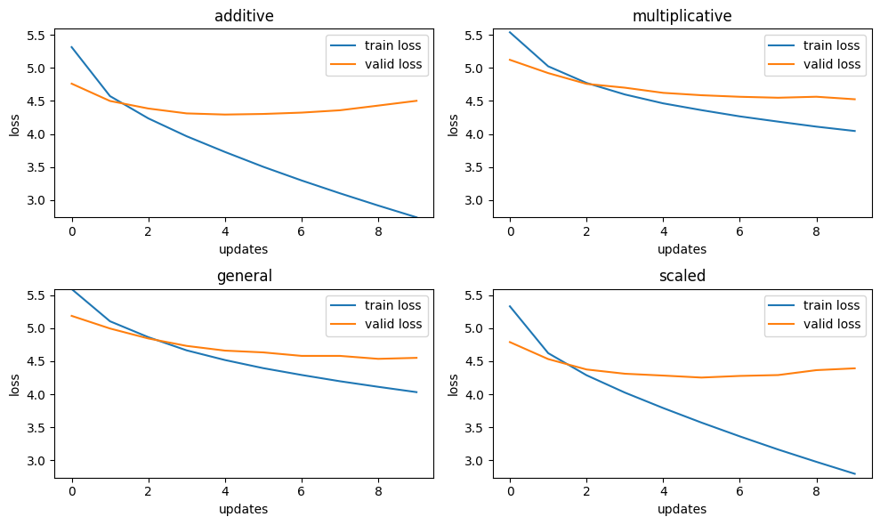
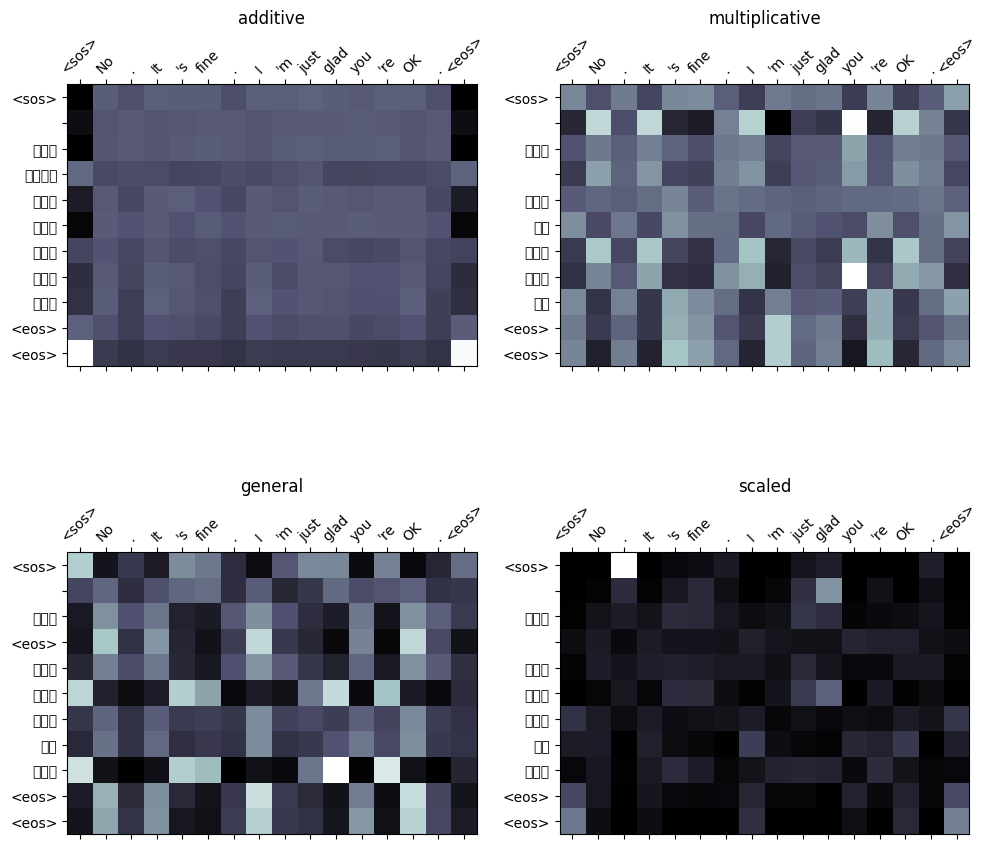
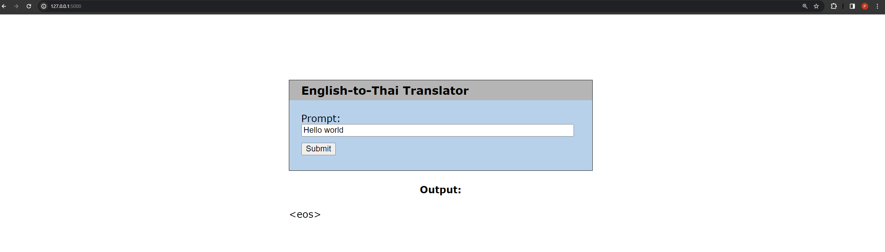

# NLP-A3-Machine-Translation
 
English-to-Thai machine translation app using Transformer Seq2Seq model.

## Dataset Used:

OPUS-100 is an English-centric multilingual corpus randomly sampled from the OPUS collection covering 100 languages. \
For English-Thai language pairs subset, there are 1,000,000 samples for training, 2,000 samples for validation, and 2,000 samples for testing. \
In this project, we reduced the size of training samples to only 20,000 due to computational limitations. \
Link: https://huggingface.co/datasets/opus100

## Word Tokenization

Tokenization of English text was done using the spaCy tokenizer which can handle special character and punctuation very well. \
For Thai text however, we used the newmm, a dictionary-based tokenizer created by Korakot Chaovavanich included in PyThaiNLP library. newmm utilizes the maximal matching algorithm and Thai Character Cluster (TCC) for word segmentation. \
spaCy tokenizer: https://spacy.io/usage/spacy-101#annotations-token
newmm tokenizer: https://github.com/wisesight/newmm-tokenizer

## Evaluation

#### Training and Validation Losses per Epoch

#### Attention Maps

#### Final Losses/Perplexities and Inference Time

| **Attentions**               | **Training Loss** | **Training PPL** | **Validation Loss** | **Validation PPL** | **Average Inference Time** |
|------------------------------|:-----------------:|:----------------:|:-------------------:|:------------------:|:--------------------------:|
| **General Attention**        |       4.113       |      61.134      |        4.536        |       93.332       |          0.00548s          |
| **Multiplicative Attention** |       4.046       |      57.158      |        4.526        |       92.366       |          0.00589s          |
| **Additive Attention**       |       3.729       |      41.634      |        4.295        |       73.297       |          0.00695s          |

Based on these results, we concluded that the transformer model with additive attention mechanism performs the best out of the three different attention mechanisms we have implemented.

## Application

1) From the terminal, use the 'cd' command to navigate to 'NLP-A3-machine-Translation/app/' directory.
2) Run the Python script 'app.py'.
3) Open your browser and go to '127.0.0.1:5000' to access the site locally.
4) Type in the English text you wish to be translated then click the submit button.
5) Your generated text will be shown below.

